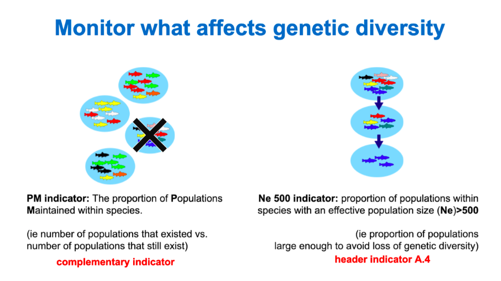

# Genetic diversity and indicators

Genetic diversity is variation at the DNA level, and includes differences among individuals within populations of species, as well as  and differences among populations of species. 
The diversity among populations within a species is critical for ensuring the adaptive potential of that species. Therefore loss to any unique, genetically distinct population can greatly compromise a species’ ability to adapt to change (both anthropogenic or environmental). It is therefore imperative that all populations be maintained.

The conservation of genetic diversity within populations depends on populations being sufficiently large, and the conservation of genetic diversity between populations depends on populations continuing to exist. Therefore, we can monitor genetic diversity not only using genetic data, but also monitoring the process that affects genetic diversity. The genetic diversity indicators adopted at COP15 by the Global Biodiversity Framework are based in these processed to monitor what affects genetic diversity.

Genetic diversity is necessary for species’ populations to remain healthy and adapt to environmental change, such as climate change, pollution, changing habitats, and pests and disease. Genetic diversity is also vital for resilience of all ecosystems, such as recovery from heat waves and ocean pollution or acidification. It is also vital for the success of ecosystem restoration and the reintroduction of populations and species. Populations with low genetic diversity suffer inbreeding, low viability, and low resilience. Unfortunately, genetic diversity has declined due to habitat loss, fragmentation, overharvest, and other human activities. 

