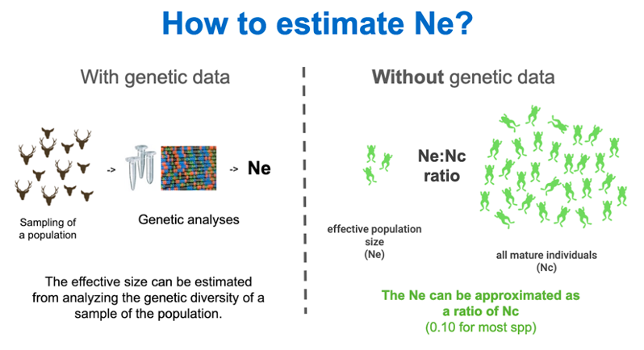

# Ne 500 indicator

The effective population size (Ne), is related to the number of breeding adults in a genetically ideal population (or the number of individuals actually contributing to the gene pool). That is why it is said that the Ne is how “a population behaves genetically”. When the Ne is below 500, genetic diversity loss accelerates by a random process called genetic drift: because fewer and fewer adults are contributing offspring, there is increased chance for some to reproduce less, or not at all, and therefore for some genetic variants to be lost, by chance.

**Effective population size (Ne) is a well-accepted metric for measuring the rate of loss of genetic diversity within populations.** As explained below (see figure), an Ne above 500 (usually a census population size of 5000) *will maintain genetic diversity within populations for a long time*. In other words, **Ne 500** is a “sufficient” size to **prevent loss of genetic diversity within populations** (using a statistic called ‘heterozygosity’) – Ne much higher than Ne 500 and genetic loss within populations is near zero. See What is a population LINK for a background on how to define a population in the context of the genetic diversity indicators. Ne below 500 is the approximate point when populations are less able to adapt via natural selection, start becoming compromised and experience genetic loss. We note that Ne below 50 will lead to very rapid increases in inbreeding, loss of fitness, and changes in the genetic composition of populations, causing high risk of extinction in the short-term. The Ne 500 and Ne 50 thresholds are useful to conservation management and recovery programmes. Because of a need to maintain genetic diversity and adaptive capacity for the long term, the Ne 500 indicator is a key genetic indicator.

The Ne 500 indicator is derived by comparing **the effective population size (Ne) of each population to a critical threshold**, 500, and reporting the proportion of populations above the threshold and therefore maintaining genetic diversity. 

The Ne of a population can be estimated with statistical methods and DNA sequence data, when that is available. But for nearly all species, such DNA analysis is not yet available. For many species, it is sufficient and appropriate to obtain the Ne by using a simple transformation of **census size Nc (the number of mature individuals) e.g. using an Ne:Nc ratio.**

An Ne:Nc conversion ratio of 0.1 generally a conservative and suitable ratio to calculate gauge Ne (although typical ratios may range from 0.1 to about 0.3 in many vertebrates and plants - this is a generalization). **Applying a 0.1 Ne:Nc ratio, Ne 500 translates to a threshold of Nc = 5000** mature individuals.  

The values for this indicator range from 0 to 1, with 0 indicating all populations have Ne<500 (no populations are large enough to sustain genetic diversity) and 1 indicating that all populations have Ne>500 (all populations are large enough to sustain genetic diversity).

**The Ne 500 indicator is likely the best evidence of genetic status and risk of genetic erosion when DNA sequencing is not available (the case for most species globally).** It is feasible and scalable for many species per country. Maintaining effective sizes above 500 will protect the genetic diversity within populations for many generations.

Thus, this indicator is directly relevant to **Goal A**, as it informs the health and resilience of species’ populations, their genetic diversity, and the threat of species extinction. Knowledge of species population’s effective size is relevant to **Target 4** as it facilitates active management of species, *ex situ* breeding programs and informs the conservation efforts and recovery process of species populations following environmental disruption. The Ne 500 indicator is a Headline indicator for Goal A and Target 4.

As noted by [Hoban et al (2023a)](https://link.springer.com/article/10.1007/s10592-022-01492-0), the Ne 500 indicator is relevant to other targets such as sustainable harvest **Targets 5 and 9** because harvested populations should be maintained at or above Ne 500. To ensure all genetically distinct populations are represented at sufficient sizes to maintain their persistence, it is relevant for **Targets 1 and 3** on biodiversity inclusive spatial planning and representative protected areas, respectively, and **Target 12** for increasing area and connectivity of green and blue spaces in urban environments to promote gene flow and species recovery. 

{: .note } the Ne 500 indicator is relevant for genetic diversity within populations and a separate indicator (i.e. complementary indicator for Goal A the “proportion of populations maintained”) is necessary for maintaining genetic diversity among populations. **Experts agree that both indicators are critical for assessing and monitoring the genetic health of species** (Hoban et al 2020, Hoban et al 2023b).

The indicator should be reported for 100+ representative species per country.  It is calculated by taking each population of a species, determining if each population is above the threshold of Ne 500, calculating a proportion of populations above the threshold for each species, and then taking a mean of these proportions across all species examined, as explained in [Hoban et al (2023b)](https://doi.org/10.1111/conl.12953) and [Hoban et al (2023c)](https://doi.org/10.32942/X2QK5W). As explained in that publication which contains the basic equations for calculation, the indicator can be weighted by taxonomic groups or other categories to offset any biases in the species selected (e.g. due to having more birds, more rare species etc.).

Although there are no global or standardized databases for species population census size. The census size of populations for many species may be available in various other sources (e.g., reports, national databases, scientific literature, government gazettes). This guidance document will help you gather and use the necessary data, from diverse sources, in a standard way (for example data sources see here).
