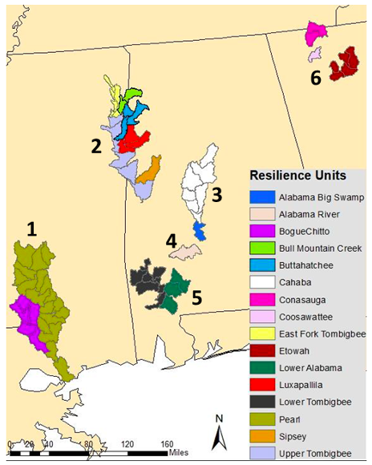

## How to account for uncertainty in the number of populations, population size or Ne/Nc ratio?

In instances where data sources provide different information for species’ populations (e.g., different size estimates for the same population or different number of populations) and the assessor cannot determine which is most reliable and/or the data cannot be amalgamated, assessors are required to submit separate data entries for the species. For a given species, there may be four submissions for example, to reflect uncertainty in ‘what is a population’ and differences in population size from different reports. In another case, there may be uncertainty about whether or not a population or group of populations remain extant, perhaps due to lack of recent survey data. In this case, multiple entries can be submitted counting the unknown populations as either extant (best case) or extinct (worst case).

Some documents may delineate populations in a hierarchical fashion, for example, based on demographic or dispersal data, while also assigning larger scale populations based on environmental differences across a species range. This is a common practice in species assessments under the U.S. Endangered Species Act. In these cases, multiple data entries were submitted based on these different scales of population delineation.

###### **Two scales of population delineation for the frecklebelly madtom (Noturus munitus) in the southeastern United States.** Watersheds (HUC10, gray outlines) were grouped into “Resilience Units” (one scale of population grouping, shown in different colors) based on barriers to dispersal, such as dams. These units were then aggregated into six larger “Representation Units” (bold numbers) delineating potential adaptive differences based on genetic, morphological, behavioral, and hydrologic variation (USFWS,2020). The populations maintained indicator varied at these two scales, with 12/16 populations maintained at the Resiliency Unit scale (PM = 0.75) vs. 5/6 populations maintained at the Representation Unit scale (PM = 0.83).

Another instance when more than one assessment could be done, is when experts or data sources have conflicting results, like a different number of populations, or if different studies report Ne based on different genetic markers or statistical methods. See for example the [expert disagreement on the number of populations Howling monkeys](https://ccgenetics.github.io/guidelines-genetic-diversity-indicators/docs/4b_Example_assessments/Example_assessments.html#expert-disagreement-on-the-number-of-populations-or-nc). In that case, alternative assessments can be done, for instance with different numbers of populations.

[Previous: How to get the Ne/Nc ratio and when NOT to use it](https://ccgenetics.github.io/guidelines-genetic-diversity-indicators/docs/3_Howto_guides_examples/Ne_Nc-ratio.html){: .btn .btn-blue .mr-4 }
[Next: Example assessments](https://ccgenetics.github.io/guidelines-genetic-diversity-indicators/docs/4b_Example_assessments/Example_assessments.html#example-assessments){: .btn .btn-green }
