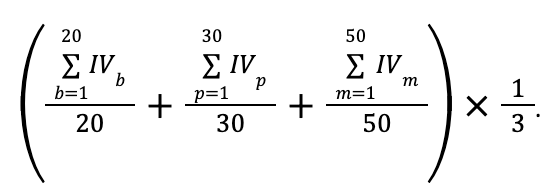
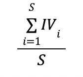
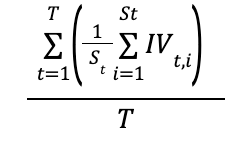
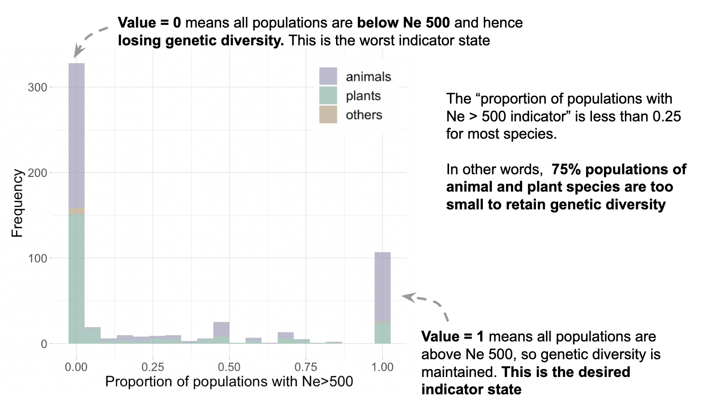

# Calculating country indicator values

The country indicator values are the mean of each indicator across species (Table 4.2; Simple indicator value. A median could be used for skewed distributions). If taxonomic groups are not represented evenly (as is likely), each indicator value is the mean of each taxonomic group’s means, which would downweight taxonomic groups that are overly represented, e.g. mammals or birds. Optionally, each species can be weighted by the proportion of its geographic range in the country, from 0 to 1, to reflect national responsibility, with full weight for endemic species. For example, when we have indicator values of 20 birds, 30 plants, and 50 mammals species, the weighted indicator value is calculated as:

 

Each indicator is easily disaggregated to different taxonomic groups by only including species in that taxonomic category.  The same can be done for different habitats, species commonness, etc.

The equations presented in Table 2 are to be applied when calculating a summary (e.g., national) metric for **either** the Populations Maintained indicator or the Ne > 500 indicator. 

### Table 2. Quantifying Country Indicators

| Simple country indicator value (IV) is the mean across species within a country. S is the total number of species and IVi is the indicator value of species i.    | Country indicator value with equal weight to different taxonomic groups. T is the number of taxonomic groups and St is the number of species of taxonomic group t.   | Indicator value weighted by the proportion of the geographic range of each species i in the country (Wi). |
|----------------------------------------------------------------------------------------------------------------------------------------------------------------------|----------------------------------------------------------------------------------------------------------------------------------------------------------------------|-----------------------------------------------------------------------------------------------------------|
|                                                                                                                                                    |                                                                                                                                         |                                                                              |

### Example of indicator values aggregated for several species 

The next result shows the actual indicator values calculated for more than 900 species in the pilot Multinational evaluation of genetic diversity indicators for the Kunming-Montreal Global Biodiversity Monitoring framework ([Mastretta-Yanes et al. 2024](https://ecoevorxiv.org/repository/view/6104/)). We found that the median across all species for the Ne 500 indicator is 0, i.e. 58% of species have that indicator value.  Worrying, ~70% of species have an indicator value less than 0.25 (Figure 6.2).  **This means that the majority of species have less than 25% of their populations large enough to sustain genetic diversity- most species are likely in danger of or are already experiencing significant genetic losses.**

 

##### *Figure. Example of aggregated indicator values*. Proportion of populations with Ne>500 for animals, plants and other taxonomic groups for more than 900 species in 9 countries. Made with data from [Mastretta-Yanes et al (2024)](https://ecoevorxiv.org/repository/view/6104/).

[Previous: Equations and example calculations](https://ccgenetics.github.io/guidelines-genetic-diversity-indicators/docs/6_Calculations_and_reporting/Equations.html#equations-and-example-calculations){: .btn .btn-blue .mr-4 }
[Next: Measuring temporal change](https://ccgenetics.github.io/guidelines-genetic-diversity-indicators/docs/6_Calculations_and_reporting/Temporal_change.html#measuring-temporal-change){: .btn .btn-green }
