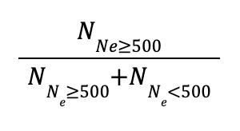
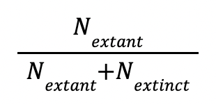
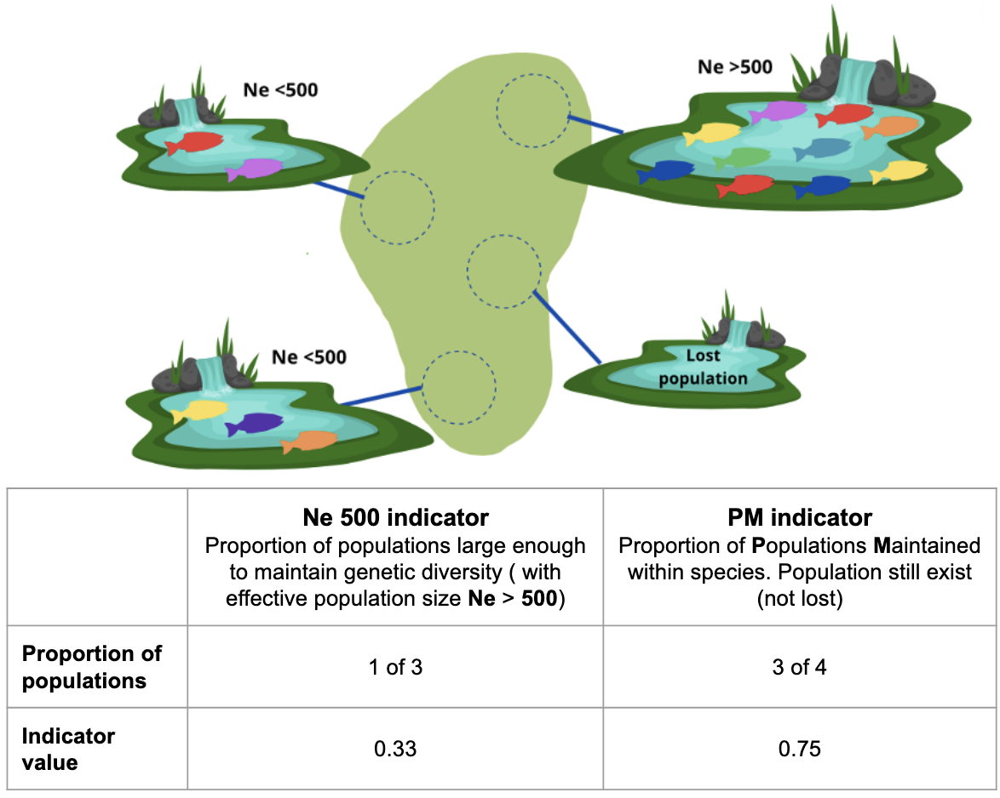

# Equations and example calculations 

Equation and definition of each indicator are in Table 1 and [Hoban et al (2023)](https://conbio.onlinelibrary.wiley.com/doi/10.1111/conl.12953). For calculating the Ne>500 indicator for each species, count the number of populations with Ne above 500 and the number with Ne below 500; these two added together should equal the total number of populations **for which data are available**. In the case in which Nc was recorded, estimates of Ne can be obtained by multiplying the Nc value by the Ne/Nc ratio. 0.1 is a conservative default value for all species' Ne/Nc ratio. Instead, a taxon-specific Ne/Nc ratio (either from that species or from a general taxa such as 0.3 for plants) can be used when it is available. 

The Ne>500 indicator can be reported as a proportion (from 0 to 1) of populations with data that are above 500, or in the form of a ratio ‘number of populations above 500’:‘total number of populations.’ Recently extinct populations would have a size of 0 to avoid an increase in the indicator value when populations are lost.

In the case of differing estimates from multiple sources, either the most recent source is used, or a mean of values based on the different sources is taken.

### Table 1 Equations for calculating the indicator values for each species

|                                                                                                                                 Ne > 500 Indicator                                                                                                                               |                                                                                                                                                   Populations Maintained (PM) Indicator                                                                                                                                                   |                                     Number of species being monitored using DNA-based methods                                     |
|:---------------------------------------------------------------------------------------------------------------------------------------------------------------------------------------------------------------------------------------------------------------------------------:|:-----------------------------------------------------------------------------------------------------------------------------------------------------------------------------------------------------------------------------------------------------------------------------------------------------------------------------------------:|:---------------------------------------------------------------------------------------------------------------------------------:|
| Proportion of populations with an effective population size (Ne) greater than 500.      **Note:** When Ne is unavailable, [measures of Nc can be used to estimate Ne](https://aliciamstt.github.io/guidelines-genetic-diversity-indicators/docs/3_Howto_guides_examples/Populations_sizes.html). 0.1 Ne/Nc conversion ratio is recommended if unknown. | Proportion of populations within a species that are maintained (i.e., extant populations) compared to the total number known (i.e., extant + extinct).       N is the number of extant or extinct populations within a species. **Note:**  A [See How to establish a reference period to estimate extinct populations](https://aliciamstt.github.io/guidelines-genetic-diversity-indicators/docs/3_Howto_guides_examples/Reference_period.html) | A count of the number of species where at least one population is being genetically (temporally) monitored with DNA-based methods |

For instance, in the example of hypothetical populations of fish (Figure. [Illustration of genetic diversity indicators for hypothetical populations](#illustration-of-genetic-diversity-indicators-for-hypothetical-populations-four-hypothetical-fish-populations-occur-within-a-country-one-fish--1000-mature-fishes-colors-show-genetic-diversity-in-the-year-the-indicators-were-assessed-1-population-is-extinct-lost-and-only-one-is-large-enough-ne--500-to-retain-genetic-diversity)). Three of four historical populations are maintained, so the PM indicator is 3/4=0.75. Only one of the remaining populations is has an Ne >500, so the Ne 500 indicator is ⅓ = 0.33. DNA-based methods have not been used to monitor genetic diversity, so the DNA-based monitoring indicator is 0.

##### **Illustration of genetic diversity indicators for hypothetical populations**. Four hypothetical fish populations occur within a country. One fish = 1000 mature fishes. Colors show genetic diversity. In the year the indicators were assessed, 1 population is extinct (lost), and only one is large enough (Ne > 500) to retain genetic diversity.

[Previous: Data collection](https://aliciamstt.github.io/guidelines-genetic-diversity-indicators/docs/5_Data_collection/Data_collection.html#data-collection){: .btn .btn-blue .mr-4 }
[Next: Calculating country indicator values](https://aliciamstt.github.io/guidelines-genetic-diversity-indicators/docs/6_Calculations_and_reporting/Country_ind_values.html#calculating-country-indicator-values){: .btn .btn-green }
